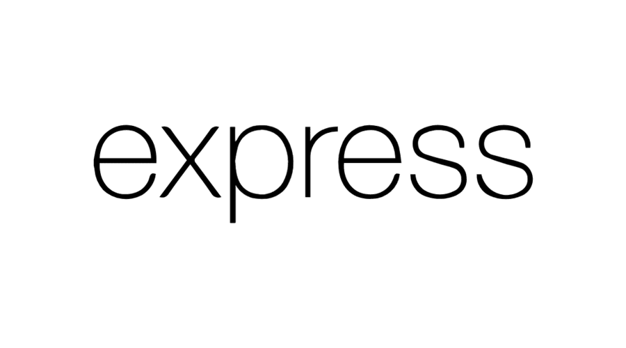
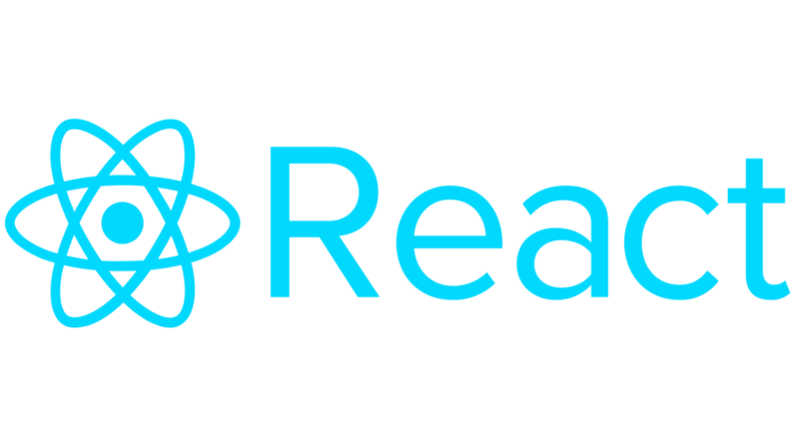
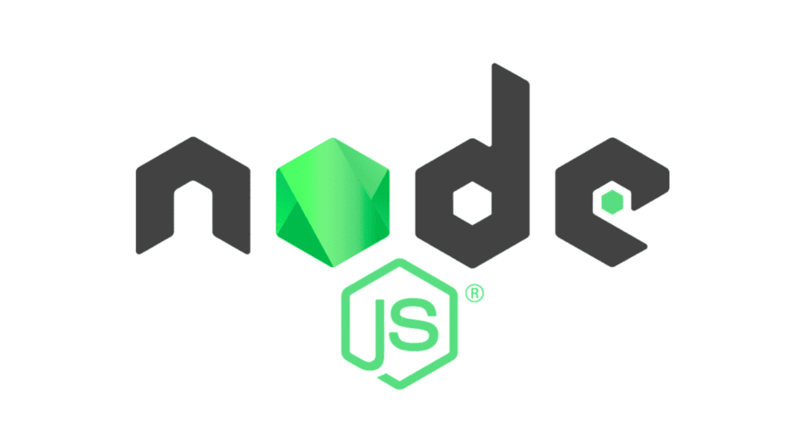
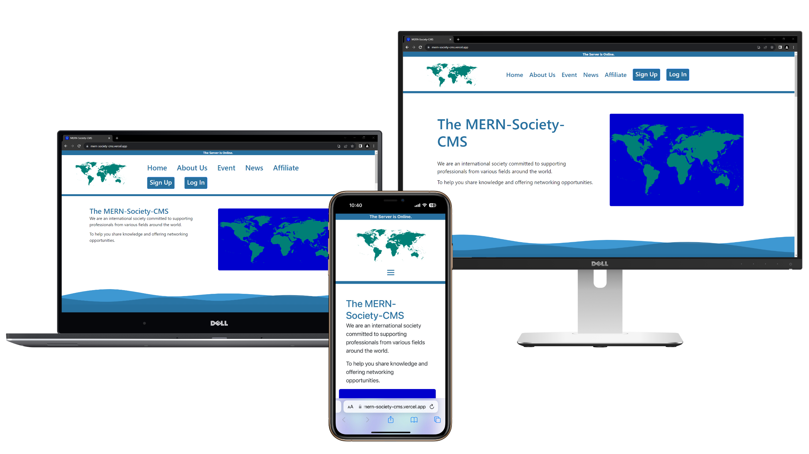

<div align="center">
  
  
  
  
</div>


# MongoDB, Express, React & NodeJS (MERN): Content Management System
My personal MERN stack project is a website designed to empower administrators with the ability to effortlessly manage events, news and affiliates through seamless CRUD operations. Additionally, registered users who opt-in will receive Mailchimp notifications, ensuring their engagement with the latest updates.


## Table of Contents
|       No      |                        Contents                         |
| :-----------: | :-----------------------------------------------------: |
|       1       |              [Key Features](#key-features)              |
|       2       |              [Technologies](#technologies)              |
|       3       |                     [Usage](#usage)                     |
|       4       |            [Configurations](#configurations)            |
|       5       |         [Responsive Design](#responsive-design)         |
|       6       |                 [Copyright](#copyright)                 |
|       7       |                   [License](#license)                   |

## Key Features
- **Events, News and Affiliates Management:** Admins can effortlessly create and manage Events, News and Affiliates informations.
- **Rich Media Support:** Images can be seamlessly included alongside Events, News and Affiliates, enhancing visual content.
- **User Role Management:** Admins have the ability to elevate Users to Admin status or revert Admins to regular Users.
- **Password Reset Requests:** Both Admins and Users can request password resets, ensuring secure account access.
- **Mailchimp Integration:** Registered Users can opt-in for updates and receive notifications via the Mailchimp platform.


## Technologies
|               Client               |                  Server                |
| :--------------------------------: | :------------------------------------: |
|             animate.css            |     @mailchimp/mailchimp_marketing     |
|               axios                |             @sendgrid/mail             |
|             bootstrap              |                 axios                  |
|            caniuse-lite            |                 bcrypt                 |
|             js-cookie              |                 cheerio                |
|            jsonwebtoken            |               cloudinary               |
|             jwt-decode             |         connect-mongodb-session        |
|               luxon                |                  cors                  |
|               react                |                 dotenv                 |
|      react-animation-on-scroll     |                 express                |
|          react-bootstrap           |             express-session            |
|        react-cookie-consent        |               jsonwebtoken             |
|             react-dom              |                  luxon                 |
|          react-dropzone            |                 mongoose               |
|          react-hook-form           |            mongoose-validator          |
|            react-icons             |                  multer                |
|         react-router-dom           |               streamifier              |
|           react-scripts            |                                        |
|         react-search-box           |                                        |
|            sweetalert2             |                                        |


## Usage
Install Dependencies:
```
npm install
```
<br>

For Client Development:
```
npm start
```
<br>

For Build Web App Scripts:
```
npm run build
```
<br>

For Client Production:
```
serve -s build
```
<br>

For Server Development:
```
nodemon
```
OR
```
npm run dev
```
<br>

For Server Production:
```
npm run prod
```
<br>


## Configurations
### Cloudinary Introduction:
Cloudinary is a robust cloud-based media management platform that serves as a valuable asset for modern applications. Its core function revolves around optimizing image storage, delivery and display within web and mobile projects. By utilizing Cloudinary, you leverage a powerful tool that streamlines the process of uploading, storing and retrieving images while ensuring optimal performance for your users.

In my particular project, Cloudinary serves the purpose of storing images in a secure cloud environment. Rather than storing images locally, Cloudinary provides an efficient way to save your images on the cloud while generating unique URLs for each image. These URLs serve as direct paths to the images, making it easy to integrate and display images within your application.

This integration allows you to store images in Cloudinary and save their corresponding URLs in MongoDB, offering a seamless mechanism to retrieve and showcase images. The result is improved user experience, quicker loading times and simplified management of your application's visual content. With Cloudinary, you enhance your project's image management capabilities and ensure smooth and efficient image display for your users.

Learn More: [Cloudinary](https://cloudinary.com/)

### SendGrid Introduction:
SendGrid, a robust cloud-based email delivery platform, is an essential component for enhancing communication within applications. Its core function centers around facilitating efficient email sending and delivery, ensuring the reliable and secure delivery of crucial messages to users' inboxes. By incorporating SendGrid into your project, you gain access to a powerful tool that simplifies the process of sending transactional and marketing emails, ultimately enhancing user engagement and interaction.

In my particular project, SendGrid serves the purpose of sending email tokens to registered users for password reset functionality. When users request a password reset, a secure token is generated and sent to their registered email addresses through SendGrid. This token serves as a temporary key that allows users to reset their passwords, enhancing security while providing a convenient recovery mechanism.

Learn More: [SendGrid](https://sendgrid.com/)

### Mailchimp Introduction:
Mailchimp serves as a versatile email marketing platform, tailored to enhance communication in the digital landscape. With its central focus on enabling businesses to conduct effective email campaigns, Mailchimp empowers personalized content delivery and precise messaging strategies. By integrating Mailchimp into your project, you gain access to a potent tool that simplifies the creation, management and analysis of email campaigns, amplifying user engagement and solidifying brand identity.

Within the framework of my particular project, Mailchimp assumes the role of delivering well-timed email notifications to users whenever new content associated with Events, News and Affiliates is posted, updated or deleted.

By seamlessly integrating Mailchimp's features, registered users who have opted in to receive notifications are automatically added as subscribers. This ensures that they stay connected and well-informed about changes and developments related to their areas of interest within the application. Through this process, Mailchimp facilitates communication by promptly sending emails to subscribers, delivering updates and insights that enrich their engagement with the evolving content landscape of the platform.

Learn More: [Mailchimp](https://mailchimp.com/)


## Responsive Design
### Desktop, Laptop, Tablet, Mobile
**Desktop and Laptop View:** On larger screens, users will be presented with a comprehensive display that prominently features the navbar and core content.

**Tablet and Mobile View:** For smaller devices, the menu bar takes center stage, accompanied by content tailored for efficient viewing on compact screens.

**Screenshot taken from the following devices:**
- Monitor: 27 Inch Monitor
- Laptop: 15.6 Inch Laptop
- Mobile: iPhone 14 Pro


<div align="center">



</div>


## Copyright
Copyright © 2023 **Rhael Fixer**. All rights reserved.


## License
This project is licensed under the [MIT License](LICENSE).
